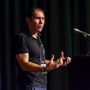

footer: © NodeProgram.com, Node.University and Azat Mardan 2017
slidenumbers: true

# Node in Production
## Summary and Outro

Azat Mardan @azat_co

---

# Containers and AWS are about robustness and flexibility.

---

# Section 1: Intro

1.

---

## Now, go ahead and teach Node to others! 🏁

---

# Further Study

*