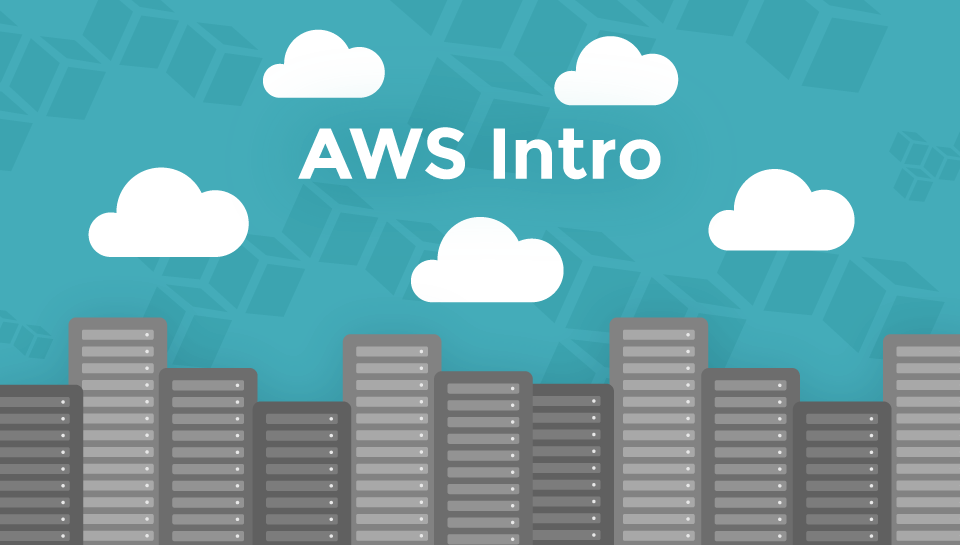
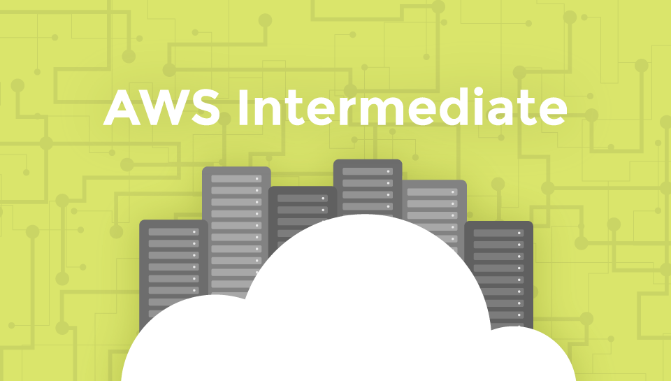

footer: © NodeProgram.com, Node.University and Azat Mardan 2017
slidenumbers: true
theme: Simple, 1
build-lists: true

# Node in Production
## Summary and Outro

Azat Mardan @azat_co

---

# Containers and AWS are about robustness and flexibility.

---

# Summary

1. Use Env Vars
1. Make your Dockerfile work for dev and prod to use the same image
1. Use Docker networks or link in AWS ECS to share services for one project

---

# AWS Certification

* Advance your career, get a promotion
* Validate and quantify your skills and expertise
* Learn and master

<https://aws.amazon.com/certification/>

---

## End of the course, but your learning doesn't stop here.

---

# Further Study

---

# AWS Intro

*Build solid foundation of main AWS concepts and services*

* Cloud and AWS Basics: AMI, types, configuration, Launching EC2s
* Environment and App Deploy Automation
* Networking: Virtual Private Cloud, Subnets, Elastic IP and Load Balancer
* S3, Auto Scaling and CloudWatch Alerts

👉 <https://node.university/p/aws-intro>

---

# AWS Intermediate

*All you need to know to start DevOps with AWS*

* DevOps Principles and Building CI/CD
* AWS CLI and AWS Node SDK
* Cloud Infrastructure Automation with CloudFormation
* AWS Databases,  PaaS and Containers and Serverless

👉 <https://node.university/p/aws-intermediate>

---

## Congrats! 🏁
