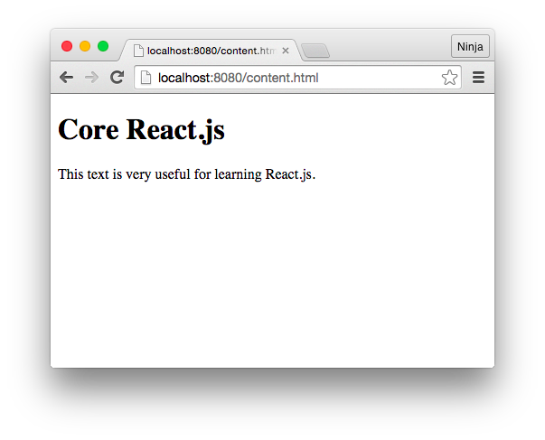

### Running the Code

Open `content.html` and check if you see title and text!



---


### Rendering

The rendering didn't change:

```js
ReactDOM.render(
  <Content />,
  document.getElementById('content')
)
```
Menu project?

<http://plnkr.co/edit/S2gjlc?p=preview>

---
